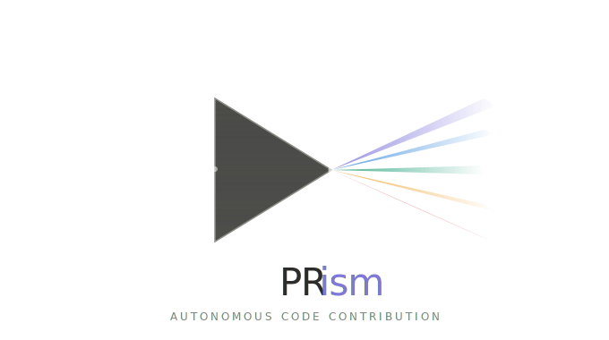

<div align="center">
  
  <h1>PRism Autonomous Engine 🚀</h1>
  <p><strong>A full-stack, production-grade autonomous PR generation system.</strong></p>
  
  <p>
    <a href="#about">About</a> •
    <a href="#features">Features</a> •
    <a href="#architecture">Architecture</a> •
    <a href="#quick-start">Quick Start</a> •
    <a href="#how-it-works">How It Works</a>
  </p>
</div>

---

## 📖 About

**PRism** is not just another UI demo—it is a robust, full-stack autonomous Pull Request (PR) generation engine. It clones any GitHub repository locally, processes it entirely within a secure sandbox, detects issues, fixes code, validates fixes through **real linters** and **real tests**, and then generates a comprehensive Pull Request ready for review.

---

## ✨ Features

- ⚡ **Real Repository Ingestion:** Uses `git clone --depth=1` instead of relying on token-limited GitHub APIs.
- 🧠 **7-Stage Agent Loop:** True Think → Plan → Execute → Validate → Debug → Retry execution pipelines.
- 🔒 **Secure Execution Sandbox:** Runs via `spawn()` with tree-killing instead of `exec()`, preventing shell injection.
- 🔍 **Real Validation Layer:** Dispatches appropriate linters (`ESLint`, `pylint`, `go vet`, `cargo clippy`) and test suites (`Jest`, `Vitest`, `pytest`, `go test`) for the detected language and framework.
- 🤖 **Multi-Provider AI Adapters:** Seamlessly swap between Google Gemini, OpenAI, Anthropic Claude, and OpenRouter architectures.
- 📺 **Real-Time Streaming:** Live WebSockets send all pipeline and AI events straight to your UI layer as they happen.
- 🎯 **Confidence Gating:** Fixes require a minimum of `0.70` confidence rating or they hit the chopping block!

---

## 🏛️ Architecture

<div align="center">
  
</div>

The application is structured into two main tiers:
1. **Frontend (`/frontend`)** - A lightweight, pure display layer in vanilla HTML/CSS/JS ensuring maximum agility without bloat.
2. **Backend (`/backend`)** - A hardened Express.js Node runtime managing REST APIs, Session states, WebSockets, Repository Git states, and intense Sandboxed validation pipelines.

---

## 🚀 Quick Start

### 1. Prerequisites
- [Node.js (v22+)](https://nodejs.org/)
- Git installed and in your system PATH
- Code linters & test suites depending on the target repository languages

### 2. Setup

Clone the repository and install dependencies:

```bash
git clone https://github.com/AnonAmit/PRism.git
cd PRism
```

Install backend dependencies:

```bash
cd backend
npm install
```

Configure your environment variables:

```bash
cp .env.example .env
# Edit .env with your configuration
```

### 3. Run the Engine

Use the workspace scripts to spin up everything!

```bash
# From the root directory:
npm run dev
```

Visit the live frontend at: **`http://localhost:3001`**

---

## 🛠️ How It Works

1. **Ingestion (Stage 1):** You punch in a GitHub Repo URL. The backend clones it, walks the directories (respecting `.gitignore`), detects the language, framework, dependencies, test framework, and CI config.
2. **Understanding (Stage 2):** PRism loads the repository context intelligently relying on dynamic token limits (Shallow = 40K, Standard = 80K, Deep = 160K), feeding the context window with relevant, high-signal data.
3. **Detection (Stage 3):** Pattern scanning + LLM-based heuristics dig up bugs, security issues, performance, and code smell problems.
4. **Prioritization (Stage 4):** Each issue is meticulously scored based on Severity, Feasibility, Contribution Value, and Inverse Risk to map them into actionable (P0-P3) tiers.
5. **Fix Generation (Stage 5):** Valid PR Candidates generate minimal diffs using carefully tuned, zero-shot/few-shot prompts preventing unwanted breakages.
6. **Validation (Stage 6):** The generated diffs are applied and then tested against **Real Sandbox linters/tests** execution for conclusive `logic_check` and `breaking_change` simulation.
7. **PR Generation (Stage 7):** Assembles a professional final Markdown document with review checklists and risk assessments.

---

> Generated natively by the **PRism AutoPR Engine**.
